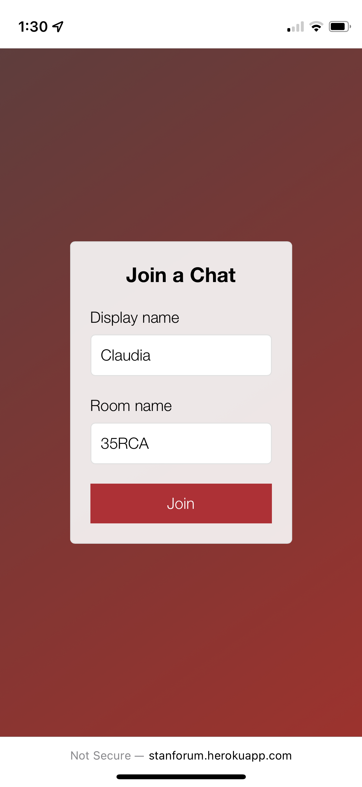
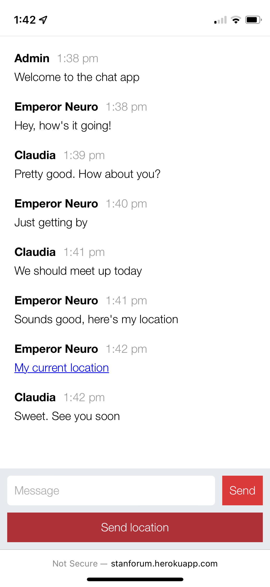

# node-chat-app
Chat application where users can join a room and choose to send their location.
Created with node.js, socket.io and react.js

Used by my high school's mental health support group for anonymous chats.

link: https://stanforum.herokuapp.com/

⛔ demo app not working due to heroku dropping their free tier :(

### Homepage

  
  

### Room page

  
  

